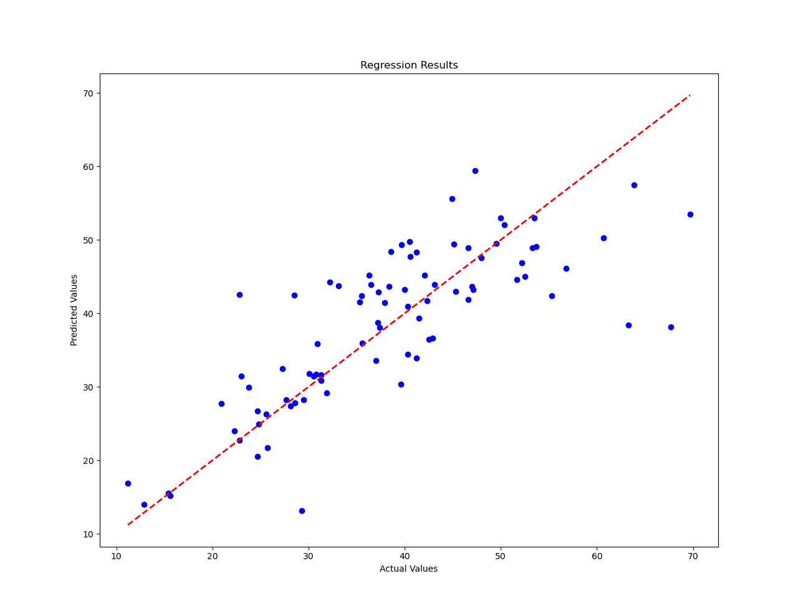
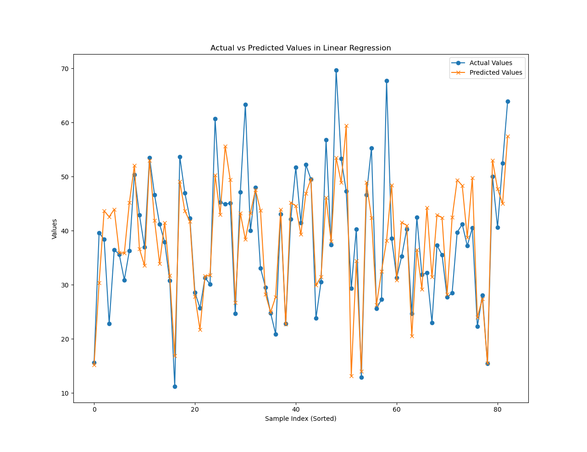

# Linear Regression(线性回归)

## 回顾

线性回归是一种用于建模和分析关系的线性方法。在简单线性回归中，我们考虑一个自变量和一个因变量之间的关系，用一条直线进行建模。而在多元线性回归中，我们可以使用多个自变量来建模，因此我们需要拟合的不再是一个简单的直线，而是在高维空间上的一个超平面。每个样本的因变量（y）在多元线性回归中依赖于多个自变量（x），这样的关系可以用一个超平面来表示，这个超平面被称为回归平面。因此，在多元线性回归中，我们试图找到一个最适合数据的超平面，以最小化实际观测值与模型预测值之间的差异。

## 数据集介绍

本例使用了一个房地产估价（[Datasets - UCI Machine Learning Repository](https://archive.ics.uci.edu/datasets)）数据集，其中包含关于房地产估价的市场历史数据集收集自台湾新北市新店区。数据以xlsx形式保存在dataset文件夹中，其中Real estate valuation data set.xlsx是数据，以下是数据集的中文解释：

abalone.data包含以下内容：


| 变量名称                | 角色 | 类型   | 人口 | 描述                                                       | 单位              | 缺失值 |
| ----------------------- | ---- | ------ | ---- | ---------------------------------------------------------- | ----------------- | ------ |
| 序号                    | 编号 | 整数   |      |                                                            |                   | 无     |
| X1 交易日期             | 特征 | 连续的 |      | 例如，2013.250=2013 年 3 月、2013.500=2013 年 6 月等。     |                   | 无     |
| X2 房龄                 | 特征 | 连续的 |      |                                                            | 年                | 无     |
| X3 到最近的地铁站的距离 | 特征 | 连续的 |      |                                                            | 米                | 无     |
| X4 便利店数量           | 特征 | 整数   |      | 步行生活圈内便利店数量                                     | 整数              | 无     |
| X5 纬度                 | 特征 | 连续的 |      | 地理坐标、纬度                                             | 度                | 无     |
| X6 经度                 | 特征 | 连续的 |      | 地理坐标、经度                                             | 度                | 无     |
| Y  户房单位面积价格    | 目标 | 连续的 |      | 10000 新台币/平，其中 Ping 是本地单位，1 平方 = 3.3 平方米 | 10000 新台币/平价 | 无     |

通过数据集字段的介绍我们可以明确我们的任务是通过不同的特征对房地产估价进行线性回归预测。

## 代码分析

### 读取数据集

首先，我们使用pandas库读取data文件

```
data = pd.read_excel('../dataset/abalone.data')
```

然后可以通过

```
print(data.head())
```

查看数据的前5行，确保数据加载正确。

### 数据处理

接着我们对离散数据进行one-hot处理，可以观察到特征中的X4便利店数量是离散型变量。

```
data = pd.get_dummies(data, columns=['X4 number of convenience stores'])
```

然后确定自变量（x）和因变量（y），根据任务需求特征作为x，预测的房价作为y。

```
X = data[['X1 transaction date',
'X2 house age',
'X3 distance to the nearest MRT station',
'X5 latitude',
'X6 longitude',
'X4 number of convenience stores_0',
'X4 number of convenience stores_1',
'X4 number of convenience stores_2',
'X4 number of convenience stores_3',
'X4 number of convenience stores_4',
'X4 number of convenience stores_5',
'X4 number of convenience stores_6',
'X4 number of convenience stores_7',
'X4 number of convenience stores_8',
'X4 number of convenience stores_9',
'X4 number of convenience stores_10']]
y = data['Y house price of unit area']

```

接着，我们需要划分训练集和测试集，使用Scikit-learn中的train_test_split函数对数据进行划分，其中test_size为测试集的比列，0.2表示20%，random_state是一个用于控制随机性的参数。在机器学习中，许多算法都涉及到某种形式的随机性，例如数据集划分、初始化模型参数等。为了使实验结果可重复，我们可以设置 `random_state` 参数的固定值。

```
X_train, X_test, y_train, y_test = train_test_split(X, y, test_size=0.2, random_state=42)
```

由于数据集具有一定的时序性我们也可以按顺序划分数据集，其中train_ratio为训练集比例。

```
train_ratio = 0.8
X_train = X[:int(train_ratio * len(data))]
X_test = X[int(train_ratio * len(data)):]
y_train = y[:int(train_ratio * len(data))]
y_test = y[int(train_ratio * len(data)):]
```

然后，将特征进行标准化，以保证特征之间的数量级一致：

```
scaler = StandardScaler()
X_train_scaled = scaler.fit_transform(X_train)
X_test_scaled = scaler.transform(X_test)
```

最后我们还需要将数据转变为张量的形式

```
X_train_tensor = torch.tensor(X_train_scaled, dtype=torch.float32)
y_train_tensor = torch.tensor(y_train.values, dtype=torch.float32).view(-1, 1)
X_test_tensor = torch.tensor(X_test_scaled, dtype=torch.float32)
y_test_tensor = torch.tensor(y_test.values, dtype=torch.float32).view(-1, 1)
```

## 模型训练

首先，我们需要定义线性回归模型 (`LinearRegressionModel`)，这里定义了一个简单的线性回归模型，继承自 `nn.Module` 类。模型包含一个线性层 (`nn.Linear`)，输入大小为 `input_size`，输出大小为 1。`input_size`是指特征个数。

```
class LinearRegressionModel(nn.Module):
    def __init__(self, input_size):
        super(LinearRegressionModel, self).__init__()
        self.linear = nn.Linear(input_size, 1)

    def forward(self, x):
        return self.linear(x)
```

然后实例化模型

```
input_size = X_train_tensor.shape[1]
model = LinearRegressionModel(input_size)
```

接着定义损失函数和优化器，使用均方误差损失 (`MSELoss`) 作为损失函数，Adam 优化器作为优化器，学习率为 0.1。

```
criterion = nn.MSELoss()
optimizer = optim.Adam(model.parameters(), lr=0.1)
```

设定训练循环，循环次数为`num_epochs = 1000`,在这个循环中，模型被设置为训练模式 (`model.train()`)，然后进行了前向传播、计算损失、反向传播和优化的步骤。每 100 次迭代输出一次损失。

```
num_epochs = 1000

for epoch in range(num_epochs):
    model.train()
    optimizer.zero_grad()

    # 前向传播
    outputs = model(X_train_tensor)
    loss = criterion(outputs, y_train_tensor)

    # 反向传播和优化
    loss.backward()
    optimizer.step()

    if (epoch + 1) % 100 == 0:
        print(f'Epoch [{epoch + 1}/{num_epochs}], Loss: {loss.item():.4f}')
```

## 模型评估

将模型设置为评估模式 (`model.eval()`)，然后使用测试集进行前向传播，并计算测试集的损失。

```
model.eval()
with torch.no_grad():
    predictions = model(X_test_tensor)
    test_loss = criterion(predictions, y_test_tensor)
```

以下代码段主要完成两个任务：首先，在第一个图形中绘制了一个散点图，展示了实际值和模型预测值之间的关系，横坐标为真实值 y_test_numpy，纵坐标为模型预测值 predictions，散点颜色为蓝色。并添加了一条红色虚线作为参考线，表示理想情况下的参考线，即真实值与预测值完全一致时的情况。接着，对数据按照时间顺序进行排序，并绘制了实际值和预测值随时间变化的曲线。

```
# 绘制结果
plt.figure(0)
plt.scatter(y_test_numpy, predictions, color='blue')
plt.plot([min(y_test_numpy), max(y_test_numpy)], [min(y_test_numpy), max(y_test_numpy)], linestyle='--', color='red',
         linewidth=2)
plt.xlabel('Actual Values')
plt.ylabel('Predicted Values')
plt.title('Regression Results')

# 按照时间顺序对数据排序
sorted_indices = X_test.index.argsort()
y_test_sorted = y_test.iloc[sorted_indices]
y_pred_sorted = pd.Series(predictions.squeeze()).iloc[sorted_indices]
# 绘制实际值和预测值的曲线
plt.figure(1)
plt.plot(y_test_sorted.values, label='Actual Values', marker='o')
plt.plot(y_pred_sorted.values, label='Predicted Values', marker='x')
plt.xlabel('Sample Index (Sorted)')
plt.ylabel('Values')
plt.title('Actual vs Predicted Values in Linear Regression')
plt.legend()
plt.show()
```




