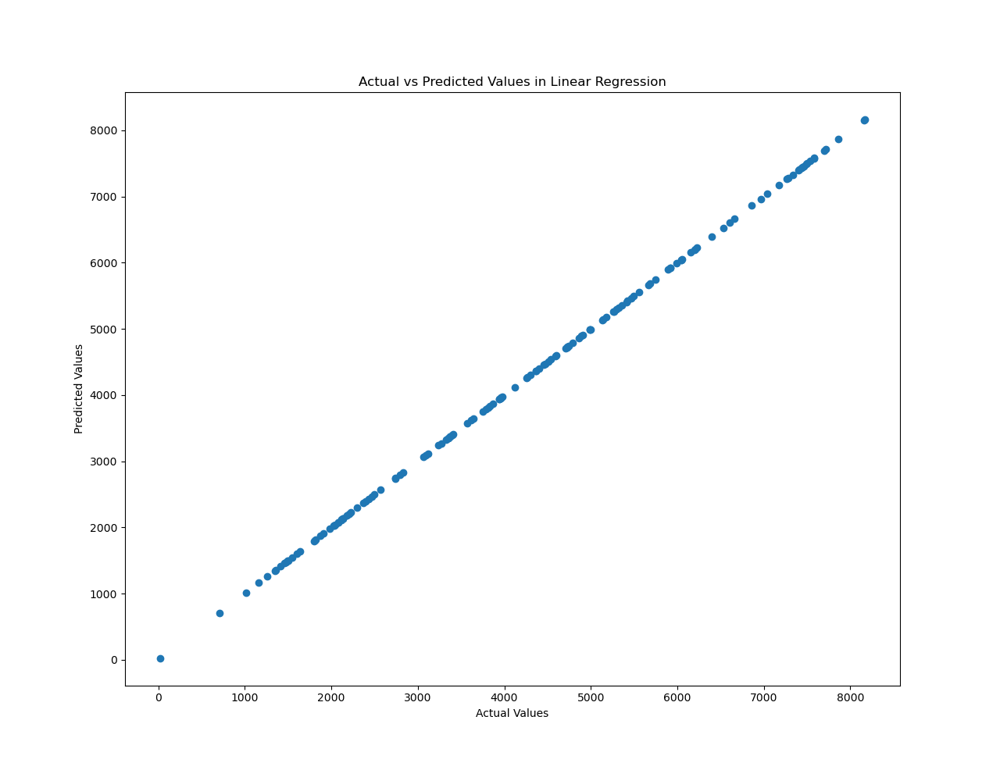
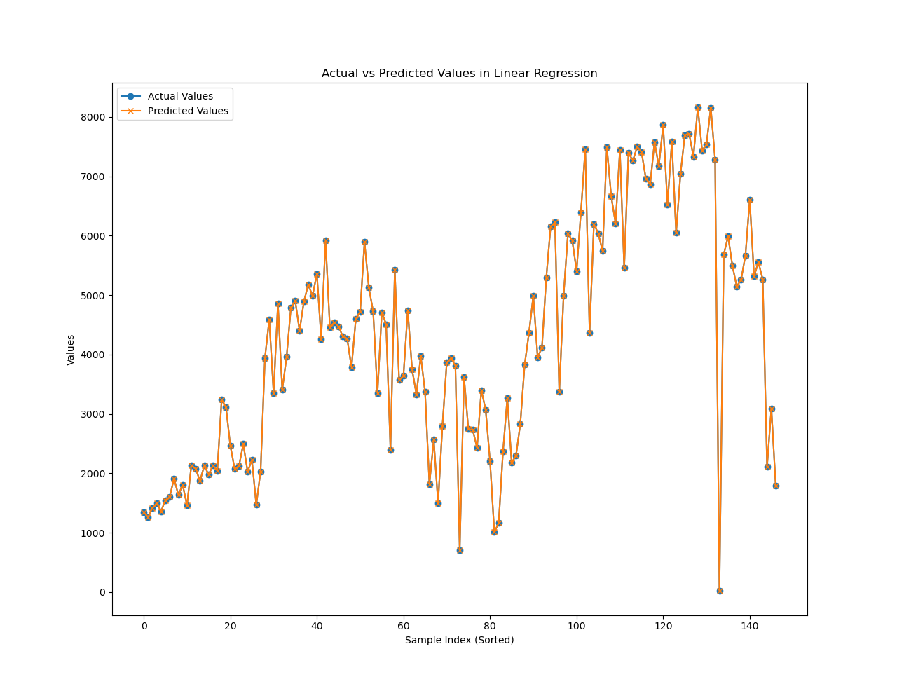

# Linear Regression(线性回归)

## 回顾

线性回归是一种用于建模和分析关系的线性方法。在简单线性回归中，我们考虑一个自变量和一个因变量之间的关系，用一条直线进行建模。而在多元线性回归中，我们可以使用多个自变量来建模，因此我们需要拟合的不再是一个简单的直线，而是在高维空间上的一个超平面。每个样本的因变量（y）在多元线性回归中依赖于多个自变量（x），这样的关系可以用一个超平面来表示，这个超平面被称为回归平面。因此，在多元线性回归中，我们试图找到一个最适合数据的超平面，以最小化实际观测值与模型预测值之间的差异。

## 数据集介绍

本例使用了一个Bike Sharing Dataset（[Datasets - UCI Machine Learning Repository](https://archive.ics.uci.edu/datasets)），其中包含关于自行车租赁的信息。数据以csv表格形式保存在dataset文件夹中，其中day.csv是按日期为最小粒度进行记录的数据，hour.csv是以小时为最小粒度进行记录的数据，Readme.txt是本案例数据的英文解释。以下是数据集的中文解释：

hour.csv和day.csv都包含以下字段，除了day.csv中没有hr字段：

* instant：记录索引
* dteday：日期
* season：季节（1: 春季，2: 夏季，3: 秋季，4: 冬季）
* yr：年份（0: 2011，1: 2012）
* mnth：月份（1 到 12）
* hr：小时（0 到 23）【day.csv中没有此字段】
* holiday：天气是否是假日
* weekday：星期几
* workingday：如果一天既不是周末也不是假日，则为1，否则为0。
* weathersit：天气状况
  * 1: 晴天，少云，局部多云，局部多云
  * 2: 薄雾 + 多云，薄雾 + 断云，薄雾 + 少云，薄雾
  * 3: 小雪，小雨 + 雷暴 + 散云，小雨 + 散云
  * 4: 大雨 + 冰块 + 雷暴 + 薄雾，雪 + 雾
* temp：摄氏度中的归一化温度。值被除以41（最大值）
* atemp：摄氏度中的归一化体感温度。值被除以50（最大值）
* hum：归一化湿度。值被除以100（最大值）
* windspeed：归一化风速。值被除以67（最大值）
* casual：休闲用户数量
* registered：注册用户数量
* cnt：总租赁自行车数量，包括休闲用户和注册用户

通过数据集字段的介绍我们可以明确我们的任务是通过不同的特征对cnt（总租赁自行车数量）进行线性回归预测。

## 代码分析

### 读取数据集

首先，我们使用pandas库读取csv文件，其中`sep=','`表示表示使用逗号作为数据文件中的字段分隔符。

```
dataset = pd.read_csv('../dataset/day.csv', sep=',')
```

然后可以通过

```
print(dataset.head())
```

查看数据的前5行，确保数据加载正确。

### 数据处理

首先，我们要想进行线性回归分析就需要在数据集中分出自变量（x）和因变量（y），根据数据集的内容和我们任务的需求自变量（x）应该为除了

```
'cnt', 'instant', 'dteday'
```

以外的字段，其中不需要instant和dteday的原因是他们本质上并不算是特征对结果没有影响。因变量应为cnt。于是我们通过pandas对数据进行切片

```
X = dataset.drop(['cnt', 'instant', 'dteday'], axis=1)  
y = dataset['cnt']
```

其中drop函数可以丢弃掉某一些列（字段），axis表示以列为单位。
接着，我们需要划分训练集和测试集，使用Scikit-learn中的train_test_split函数对数据进行划分，

```
X_train, X_test, y_train, y_test = train_test_split(X, y, test_size=0.2, random_state=42)
```

其中test_size为测试集的比列，0.2表示20%，random_state是一个用于控制随机性的参数。在机器学习中，许多算法都涉及到某种形式的随机性，例如数据集划分、初始化模型参数等。为了使实验结果可重复，我们可以设置 `random_state` 参数的固定值。
在实际的例子中，自变量往往不一定都为连续型变量，如本例中的一些字段：

```
'season', 'yr', 'mnth', 'holiday', 'weekday', 'workingday', 'weathersit'
```

此时我们需要对这些自变量进行独热编码处理：

```
categorical_features = ['season', 'yr', 'mnth', 'holiday', 'weekday', 'workingday', 'weathersit']
X_train_encoded = pd.get_dummies(X_train, columns=categorical_features)
X_test_encoded = pd.get_dummies(X_test, columns=categorical_features)
```

最后，将特征进行标准化，以保证特征之间的数量级一致：

```
scaler = StandardScaler()
X_train_scaled = scaler.fit_transform(X_train_encoded)
X_test_scaled = scaler.transform(X_test_encoded)
```

这里使用Scikit-learn提供的标准化类对特征进行标准化处理。

### 模型训练

在模型训练阶段，我们使用了Scikit-learn库中的LinearRegression类。创建并训练线性回归模型：

```
linear_reg_model = LinearRegression()
linear_reg_model.fit(X_train_scaled, y_train)
```

### 模型评估

为了评估模型性能，我们使用了均方误差（Mean Squared Error，MSE）和R平方（R-squared）等指标。在测试集上进行预测后，我们计算了实际值与预测值之间的均方误差和R平方值。

```
y_pred = linear_reg_model.predict(X_test_scaled)
mse = mean_squared_error(y_test, y_pred)
r2 = r2_score(y_test, y_pred)

print(f'Mean Squared Error: {mse}')
print(f'R-squared: {r2}')
```

### 可视化

以下代码段主要完成两个任务：首先，在第一个图形中绘制了一个散点图，展示了实际值和模型预测值之间的关系，横坐标为真实值 y_test_numpy，纵坐标为模型预测值 predictions，散点颜色为蓝色。并添加了一条红色虚线作为参考线，表示理想情况下的参考线，即真实值与预测值完全一致时的情况。接着，对数据按照时间顺序进行排序，并绘制了实际值和预测值随时间变化的曲线。

```
# 绘制预测结果和实际值的散点图
plt.figure(0)
plt.scatter(y_test, y_pred)
plt.xlabel('Actual Values')
plt.ylabel('Predicted Values')
plt.title('Actual vs Predicted Values in Linear Regression')

# 按照时间顺序对数据排序
sorted_indices = X_test_encoded.index.argsort()
y_test_sorted = y_test.iloc[sorted_indices]
y_pred_sorted = pd.Series(y_pred).iloc[sorted_indices]

# 绘制实际值和预测值的曲线
plt.figure(1)
plt.plot(y_test_sorted.values, label='Actual Values', marker='o')
plt.plot(y_pred_sorted.values, label='Predicted Values', marker='x')
plt.xlabel('Sample Index (Sorted)')
plt.ylabel('Values')
plt.title('Actual vs Predicted Values in Linear Regression')
plt.legend()
plt.show()
```





