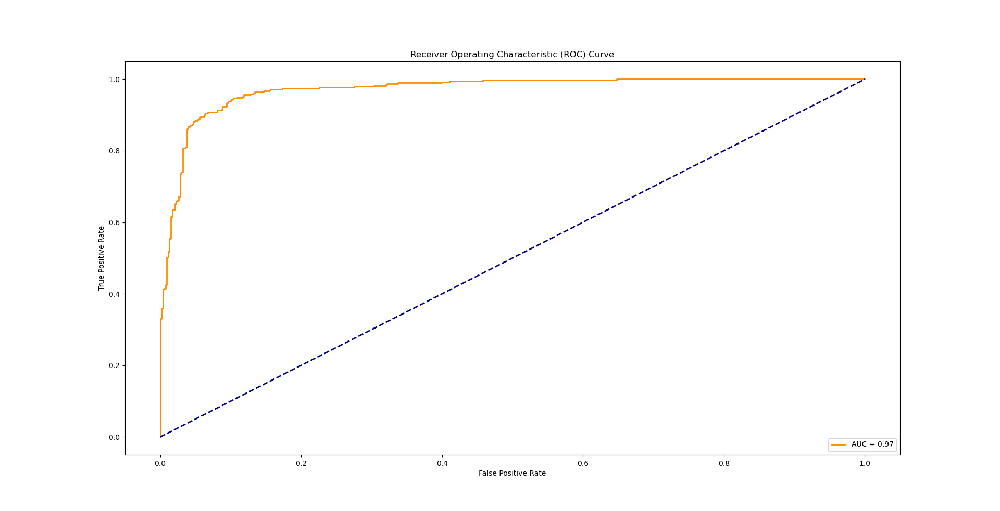

# Logistic Regression(逻辑回归)

## 回顾

Logistic Regression（逻辑回归）是一种用于处理二分类问题的统计学习方法。它基于线性回归模型，通过Sigmoid函数将输出映射到[0, 1]范围内，表示概率。逻辑回归常被用于预测某个实例属于正类别的概率。

## 数据集介绍

本例使用了一个垃圾邮件的数据集[Spambase - UCI Machine Learning Repository](https://archive.ics.uci.edu/dataset/94/spambase)

* 实例数量：

4601（垃圾邮件1813封，占39.4%）

* 属性数量：

58（57个连续属性，1个名义类别标签）

* 属性信息：

最后一列'spam'（垃圾邮件数据）表示邮件是否被视为垃圾邮件（1）或非垃圾邮件（0），即不受欢迎的商业电子邮件。多数属性指示特定单词或字符在邮件中是否经常出现。

## 代码分析

### 读取数据集

通过`pandas`库读取存储在'../dataset/spambase.data'文件中的数据集。其中`header=None`表示不需要表头。

```
# 假设数据保存在spambase.data文件中
dataset = pd.read_csv('../dataset/spambase.data', header=None)
```

### 数据处理

构建数据集，选取特征x和目标y

```
# 特征集，排除目标变量
X = dataset.iloc[:, :-1]
y = dataset.iloc[:, -1]
``````

划分数据集

```
# 划分训练集和测试集
X_train, X_test, y_train, y_test = train_test_split(X, y, test_size=0.2, random_state=42)
```

进行标准化处理

```
# 使用标准化进行特征缩放(本例中的特征都是离散型实际上可以不进行归一化)
scaler = StandardScaler()
X_train_scaled = scaler.fit_transform(X_train)
X_test_scaled = scaler.transform(X_test)
```

将数据转变为张量的形式

```
# 将数据转换为PyTorch张量
X_train_tensor = torch.tensor(X_train_scaled, dtype=torch.float32)
y_train_tensor = torch.tensor(y_train.values, dtype=torch.float32)
X_test_tensor = torch.tensor(X_test_scaled, dtype=torch.float32)
y_test_tensor = torch.tensor(y_test.values, dtype=torch.float32)
```

创建数据加载器

```
# 创建数据加载器
train_dataset = TensorDataset(X_train_tensor, y_train_tensor)
train_loader = DataLoader(train_dataset, batch_size=64, shuffle=True)
```

### 模型训练

首先，我们需要定义逻辑回归模型 (`LogisticRegressionModel`)，这里定义了一个简单的线性回归模型，继承自 `nn.Module` 类。模型包含一个线性层 (`nn.Linear`)和一个sigmoid函数，输入大小为 `input_size`，输出大小为 1。`input_size`是指特征个数。

```
# 定义逻辑回归模型
class LogisticRegressionModel(nn.Module):
    def __init__(self, input_size):
        super(LogisticRegressionModel, self).__init__()
        self.linear = nn.Linear(input_size, 1)

    def forward(self, x):
        return torch.sigmoid(self.linear(x))
```

然后实例化模型

```
# 初始化模型
input_size = X_train_scaled.shape[1]
model = LogisticRegressionModel(input_size)
```

接着定义损失函数和优化器，使用均方误差损失 (`BCELoss`) 作为损失函数，Adam 优化器作为优化器，学习率为 0.01。

```
criterion = nn.BCELoss()
optimizer = optim.Adam(model.parameters(), lr=0.01)
```

设定训练循环，循环次数为`num_epochs = 100`,在这个循环中，模型被设置为训练模式 (`model.train()`)，然后进行了前向传播、计算损失、反向传播和优化的步骤。每 10 次迭代输出一次损失。

```
# 训练模型
num_epochs = 100
for epoch in range(num_epochs):
    model.train()
    total_loss = 0
    for inputs, labels in train_loader:
        optimizer.zero_grad()
        outputs = model(inputs)
        loss = criterion(outputs, labels.view(-1, 1))
        loss.backward()
        optimizer.step()
        total_loss += loss.item()
    avg_loss = total_loss / len(train_loader)
    if (epoch + 1) % 10 == 0:
        print(f'Epoch [{epoch + 1}/{num_epochs}], Loss: {avg_loss:.4f}')
```

### 模型评估

将模型设置为评估模式 (`model.eval()`)，然后使用测试集进行前向传播，并计算测试集的损失

```
# 在测试集上评估模型
with torch.no_grad():
    model.eval()
    test_outputs = model(X_test_tensor)
    fpr, tpr, thresholds = roc_curve(y_test, test_outputs.numpy())
    roc_auc = auc(fpr, tpr)
```

### 可视化

以下代码用于绘制 ROC（Receiver Operating Characteristic）曲线，ROC 曲线是用于评估二元分类器性能的一种常用工具。其中 `fpr` 是假正例率（False Positive Rate），`tpr` 是真正例率（True Positive Rate）。ROC 曲线是以假正例率为横轴，真正例率为纵轴的曲线，用于展示不同阈值下的分类器性能。简单来说ROC 曲线下的面积（AUC）的值越大分类效果越好。

```
# 绘制ROC曲线
plt.figure(figsize=(10, 6))
plt.plot(fpr, tpr, color='darkorange', lw=2, label=f'AUC = {roc_auc:.2f}')
plt.plot([0, 1], [0, 1], color='navy', lw=2, linestyle='--')
plt.xlabel('False Positive Rate')
plt.ylabel('True Positive Rate')
plt.title('Receiver Operating Characteristic (ROC) Curve')
plt.legend(loc='lower right')
plt.show()
```



```

```
