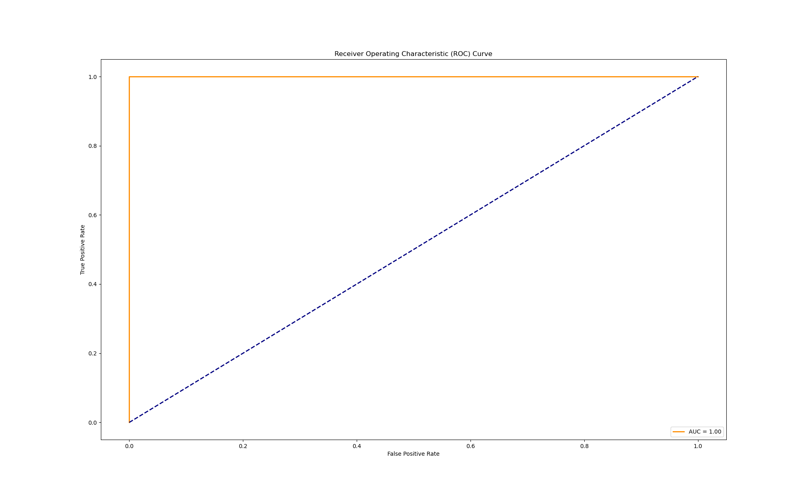

# Logidtic Regression(逻辑回归)

## 回顾

Logistic Regression（逻辑回归）是一种用于处理二分类问题的统计学习方法。它基于线性回归模型，通过Sigmoid函数将输出映射到[0, 1]范围内，表示概率。逻辑回归常被用于预测某个实例属于正类别的概率。

## 数据集介绍

本例使用了一个的蘑菇数据集[Mushroom - UCI Machine Learning Repository](https://archive.ics.uci.edu/dataset/73/mushroom)

该数据集包含对23种有褶菌的蘑菇进行描述的假设样本。每个物种被确定为绝对可食用、绝对有毒。后者的类别与有毒物种合并。即二元分类有毒和没毒。
其中第一列是有毒和没毒的目标列，其余列为特征列。具体如下：

类别:

* 可食用(edible)=e, 有毒(poisonous)=p
  属性信息:
* 帽形状: bell=b,conical=c,convex=x,flat=f, knobbed=k,sunken=s
* 帽表面: fibrous=f,grooves=g,scaly=y,smooth=s
* 帽颜色: brown=n,buff=b,cinnamon=c,gray=g,green=r, pink=p,purple=u,red=e,white=w,yellow=y
* 有淤血吗:bruises=t,no=f
* 气味: almond=a,anise=l,creosote=c,fishy=y,foul=f, musty=m,none=n,pungent=p,spicy=s
* 褶附着: attached=a,descending=d,free=f,notched=n
* 褶间距: close=c,crowded=w,distant=d
* 褶大小: broad=b,narrow=n
* 褶颜色: black=k,brown=n,buff=b,chocolate=h,gray=g,green=r,orange=o,pink=p,purple=u,red=e, white=w,yellow=y
* 柄形状: enlarging=e,tapering=t
* 柄根: bulbous=b,club=c,cup=u,equal=e,rhizomorphs=z,rooted=r,missing=?
* 环上柄表面: fibrous=f,scaly=y,silky=k,smooth=s
* 环下柄表面: fibrous=f,scaly=y,silky=k,smooth=s
* 环上柄颜色: brown=n,buff=b,cinnamon=c,gray=g,orange=o, pink=p,red=e,white=w,yellow=y
* 环下柄颜色: brown=n,buff=b,cinnamon=c,gray=g,orange=o, pink=p,red=e,white=w,yellow=y
* 薄片类型:partial=p,universal=u
* 薄片颜色: brown=n,orange=o,white=w,yellow=y
* 环数量: none=n,one=o,two=t
* 环类型: cobwebby=c,evanescent=e,flaring=f,large=l, none=n,pendant=p,sheathing=s,zone=z
* 孢子印颜色: black=k,brown=n,buff=b,chocolate=h,green=r, orange=o,purple=u,white=w,yellow=y
* 种群: abundant=a,clustered=c,numerous=n, scattered=s,several=v,solitary=y
* 栖息地: grasses=g,leaves=l,meadows=m,paths=p, urban=u,waste=w,woods=d

## 代码分析

### 读取数据集

通过`pandas`库读取存储在'../dataset/agaricus-lepiota.data'文件中的数据集。其中`header=None`表示不需要表头。

```
# 假设数据保存在agaricus-lepiota.data文件中
dataset = pd.read_csv('../dataset/agaricus-lepiota.data', header=None)
```

### 数据处理

数据集中缺失的数据都用'?'代替，我们需要去除掉这一部分数据。

```
# 去除数据中的异常值
dataset = dataset.replace('?', np.nan)
dataset = dataset.dropna(axis=0)

```

构建数据集，选取特征x和目标y

```
# 特征集，排除目标变量
X = dataset.iloc[:, 0:]
y = dataset.iloc[:, 0]
```

数据集中的特征都为分类变量，因此需要进行编码

```
# 处理类别特征：使用独热编码
X_encoded = pd.get_dummies(X)
划分数据集
```

```
# 划分训练集和测试集
X_train, X_test, y_train, y_test = train_test_split(X_encoded, y, test_size=0.2, random_state=42)
```

进行标准化处理

```
# 使用标准化进行特征缩放(本例中的特征都是离散型实际上可以不进行归一化)
scaler = StandardScaler()
X_train_scaled = scaler.fit_transform(X_train)
X_test_scaled = scaler.transform(X_test)
```

在pytorch中需要先将标签变为数值型

```
# 将字符串标签转换为数值标签
label_encoder = LabelEncoder()
y_train_numeric = label_encoder.fit_transform(y_train)
y_test_numeric = label_encoder.transform(y_test)
将数据转变为张量的形式
```

将数据转换为pytorch需要的张量形式

```
# 将数据转换为PyTorch张量
X_train_tensor = torch.tensor(X_train_scaled, dtype=torch.float32)
y_train_tensor = torch.tensor(y_train.values, dtype=torch.float32)
X_test_tensor = torch.tensor(X_test_scaled, dtype=torch.float32)
y_test_tensor = torch.tensor(y_test.values, dtype=torch.float32)
```

创建数据加载器

```
# 创建数据加载器
train_dataset = TensorDataset(X_train_tensor, y_train_tensor)
train_loader = DataLoader(train_dataset, batch_size=64, shuffle=True)
```

### 模型训练

首先，我们需要定义逻辑回归模型 (`LogisticRegressionModel`)，这里定义了一个简单的线性回归模型，继承自 `nn.Module` 类。模型包含一个线性层 (`nn.Linear`)和一个sigmoid函数，输入大小为 `input_size`，输出大小为 1。`input_size`是指特征个数。

```
# 定义逻辑回归模型
class LogisticRegressionModel(nn.Module):
    def __init__(self, input_size):
        super(LogisticRegressionModel, self).__init__()
        self.linear = nn.Linear(input_size, 1)

    def forward(self, x):
        return torch.sigmoid(self.linear(x))
```

然后实例化模型

```
# 初始化模型
input_size = X_train_scaled.shape[1]
model = LogisticRegressionModel(input_size)
```

接着定义损失函数和优化器，使用均方误差损失 (`BCELoss`) 作为损失函数，Adam 优化器作为优化器，学习率为 0.01。

```
criterion = nn.BCELoss()
optimizer = optim.Adam(model.parameters(), lr=0.01)
```

设定训练循环，循环次数为`num_epochs = 100`,在这个循环中，模型被设置为训练模式 (`model.train()`)，然后进行了前向传播、计算损失、反向传播和优化的步骤。每 10 次迭代输出一次损失。

```
# 训练模型
num_epochs = 100
for epoch in range(num_epochs):
    total_loss = 0
    for inputs, labels in train_loader:
        optimizer.zero_grad()
        outputs = model(inputs)
        loss = criterion(outputs, labels.view(-1, 1))
        loss.backward()
        optimizer.step()
        total_loss += loss.item()
    avg_loss = total_loss / len(train_loader)
    if (epoch + 1) % 10 == 0:
        print(f'Epoch [{epoch + 1}/{num_epochs}], Loss: {avg_loss:.4f}')
```

### 模型评估

将模型设置为评估模式 (`model.eval()`)，然后使用测试集进行前向传播，并计算测试集的损失

```
# 在测试集上评估模型
with torch.no_grad():
    model.eval()
    test_outputs = model(X_test_tensor)
    fpr, tpr, thresholds = roc_curve(y_test_numeric, test_outputs.numpy())
    roc_auc = auc(fpr, tpr)
```

### 可视化

以下代码用于绘制 ROC（Receiver Operating Characteristic）曲线，ROC 曲线是用于评估二元分类器性能的一种常用工具。其中 `fpr` 是假正例率（False Positive Rate），`tpr` 是真正例率（True Positive Rate）。ROC 曲线是以假正例率为横轴，真正例率为纵轴的曲线，用于展示不同阈值下的分类器性能。简单来说ROC 曲线下的面积（AUC）的值越大分类效果越好。

```
# 绘制ROC曲线
plt.figure(figsize=(10, 6))
plt.plot(fpr, tpr, color='darkorange', lw=2, label=f'AUC = {roc_auc:.2f}')
plt.plot([0, 1], [0, 1], color='navy', lw=2, linestyle='--')
plt.xlabel('False Positive Rate')
plt.ylabel('True Positive Rate')
plt.title('Receiver Operating Characteristic (ROC) Curve')
plt.legend(loc='lower right')
plt.show()
```


