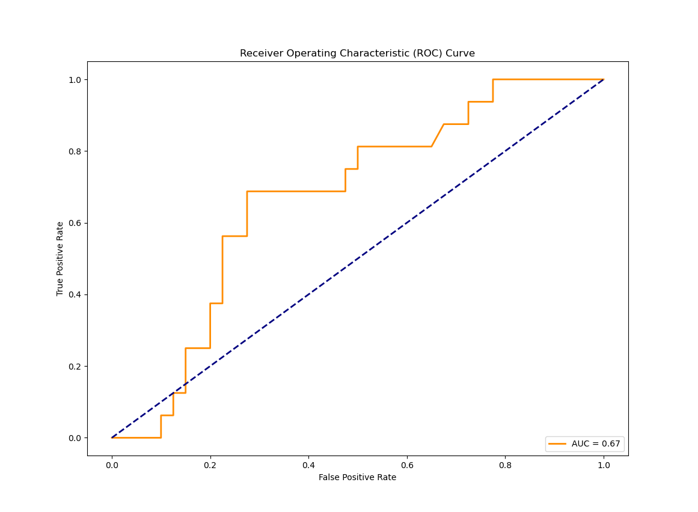

# Logidtic Regression(逻辑回归)

## 回顾

Logistic Regression（逻辑回归）是一种用于处理二分类问题的统计学习方法。它基于线性回归模型，通过Sigmoid函数将输出映射到[0, 1]范围内，表示概率。逻辑回归常被用于预测某个实例属于正类别的概率。

## 数据集介绍

在本例中，使用了乳腺癌数据集[Breast Cancer - UCI Machine Learning Repository](https://archive.ics.uci.edu/dataset/14/breast+cancer)，其中包含关于病人的信息，目标是预测肿瘤是否为无复发事件（no-recurrence-events）或有复发事件（recurrence-events）。

属性信息：

1. Class（类别）：无复发事件（no-recurrence-events），有复发事件（recurrence-events）
2. 年龄（age）：10-19岁，20-29岁，30-39岁，40-49岁，50-59岁，60-69岁，70-79岁，80-89岁，90-99岁。
3. 绝经状态（menopause）：小于40岁（lt40），大于等于40岁（ge40），未绝经（premeno）。
4. 肿瘤大小（tumor-size）：0-4，5-9，10-14，15-19，20-24，25-29，30-34，35-39，40-44，45-49，50-54，55-59。
5. 受影响淋巴结数目（inv-nodes）： 0-2，3-5，6-8，9-11，12-14，15-17，18-20，21-23，24-26，27-29，30-32，33-35，36-39。
6. 淋巴结包膜（node-caps）：是（yes），否（no）。
7. 肿瘤恶性程度（deg-malig）：1，2，3。
8. 乳房位置（breast）：左（left），右（right）。
9. 乳房区块（breast-quad）： 左上（left-up），左下（left-low），右上（right-up），右下（right-low），中央（central）。
10. 放疗（irradiat）： 是（yes），否（no）。

## 代码分析

### 读取数据集

通过`pandas`库读取存储在'../dataset/breast-cancer.data'文件中的数据集。

```
# 假设数据保存在breast-cancer.data文件中
dataset = pd.read_csv('../dataset/breast-cancer.data')
```

添加字段

```
# 添加列名
column_names = ['Class', 'age', 'menopause', 'tumor-size', 'inv-nodes', 'node-caps', 'deg-malig', 'breast', 'breast-quad', 'irradiat']
dataset.columns = column_names
```

### 数据处理

处理数据集中的异常值，将'?'替换为NaN，并删除包含NaN值的行。

```
# 去除数据中的异常值
dataset = dataset.replace('?', np.nan)
dataset = dataset.dropna(axis=0)
```

构建数据集，选取特征x和目标y

```
# 特征集，排除目标变量 'Class'
X = dataset.drop(['Class'], axis=1)
y = dataset['Class']
```

类别特征进行one-hot编码

```
# 处理类别特征：使用独热编码
X_encoded = pd.get_dummies(X)
print(X_encoded.keys())
```

划分数据集

```
# 划分训练集和测试集
X_train, X_test, y_train, y_test = train_test_split(X_encoded, y, test_size=0.2, random_state=42)
```

进行标准化处理

```
# 使用标准化进行特征缩放(本例中的特征都是离散型实际上可以不进行归一化)
scaler = StandardScaler()
X_train_scaled = scaler.fit_transform(X_train)
X_test_scaled = scaler.transform(X_test)
```

将字符串目标准换为数值标签（方便画图，在sklearn中可以不转换）

```
# 将字符串标签转换为数值标签，方便之后画图
label_encoder = LabelEncoder()
y_train_numeric = label_encoder.fit_transform(y_train)
y_test_numeric = label_encoder.transform(y_test)
```

### 模型训练

使用逻辑回归模型进行训练，其中C是正则化参数。

```
# 训练逻辑回归模型
logreg = LogisticRegression(C=1e5)
logreg.fit(X_train_scaled, y_train_numeric)
```

### 模型评估

通过预测概率计算ROC曲线，并计算曲线下的面积（AUC）来评估模型性能。

```
# 预测正类别（类别 1）的概率
prepro = logreg.predict_proba(X_test_scaled)[:, 1]

# 计算假正例率（fpr）、真正例率（tpr）和阈值
fpr, tpr, thresholds = roc_curve(y_test_numeric, prepro)
```

### 可视化

以下代码用于绘制 ROC（Receiver Operating Characteristic）曲线，ROC 曲线是用于评估二元分类器性能的一种常用工具。其中 `fpr` 是假正例率（False Positive Rate），`tpr` 是真正例率（True Positive Rate）。ROC 曲线是以假正例率为横轴，真正例率为纵轴的曲线，用于展示不同阈值下的分类器性能。简单来说ROC 曲线下的面积（AUC）的值越大分类效果越好。

```
# 计算 ROC 曲线下的面积（AUC）
roc_auc = auc(fpr, tpr)

# 绘制 ROC 曲线
plt.figure(figsize=(10, 6))
plt.plot(fpr, tpr, color='darkorange', lw=2, label=f'AUC = {roc_auc:.2f}')
plt.plot([0, 1], [0, 1], color='navy', lw=2, linestyle='--')
plt.xlabel('False Positive Rate')
plt.ylabel('True Positive Rate')
plt.title('Receiver Operating Characteristic (ROC) Curve')
plt.legend(loc='lower right')
plt.show()
```


