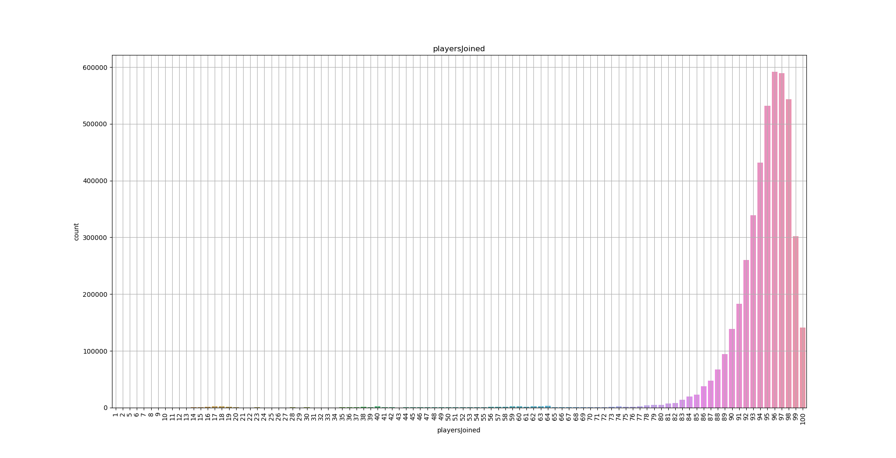
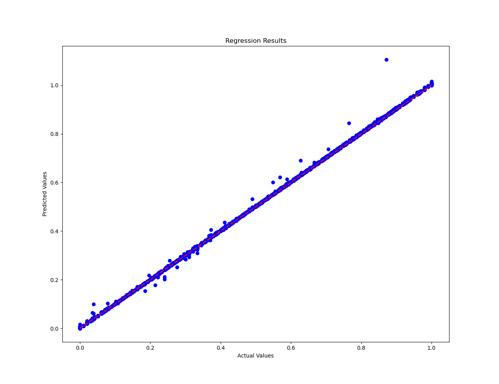
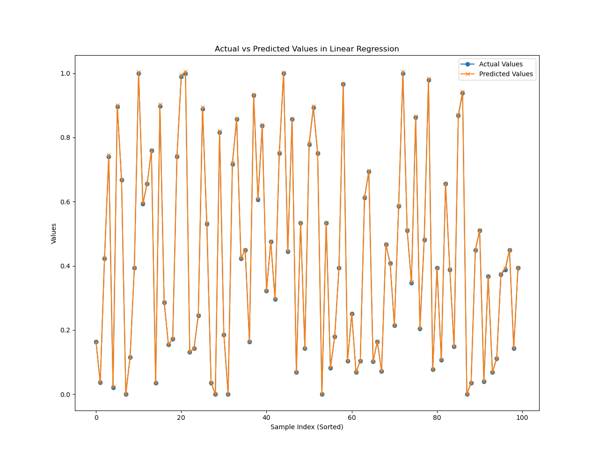

# DNN

## 回顾

本文介绍了如何使用 PyTorch 实现一个简单的深度神经网络（DNN）模型，并用于回归任务。该模型通过训练数据集来预测玩家在游戏中的最终排名百分比。代码通过读取数据集、数据处理、模型训练和模型评估等步骤，详细展示了整个实现过程。

## 数据集介绍

数据字段

* Id - 玩家ID。
* groupId - 队伍的 ID。 如果同一组玩家在不同的比赛中比赛，他们每次都会有不同的 GroupId。
* matchId - 匹配的 ID（每一局一个 ID）。
* assists - 伤害过多少敌人（最终该敌人被队友杀害）。
* boosts - 使用过多少个提升性的物品 (boost items used)。
* damageDealt - 造成的总伤害-自己所受的伤害。
* DBNOs - 击倒多少敌人。
* headshotKills - 通过爆头而杀死的敌人数量。
* heals - 使用了多少救援类物品。
* killPlace - 杀死敌人数量的排名。
* killPoints - 基于杀戮的玩家外部排名。将其视为Elo排名，只有杀死才有意义。如果 rankPoints 中的值不是 -1，那么 killPoints 中的任何 0 都应被视为“无”。
* kills - 杀死的敌人的数量。
* killStreaks - 短时间内杀死敌人的最大数量。
* longestKill - 玩家和玩家在死亡时被杀的最长距离。 这可能会产生误导，因为击倒一名球员并开走可能会导致最长的杀戮统计数据。
* matchDuration - 匹配用了多少秒。
* matchType - 单排/双排/四排；标准模式是 “solo”，“duo”，“squad”，“solo-fpp”，“duo-fpp”和“squad-fpp”; 其他模式来自事件或自定义匹配。
* maxPlace - 在该局中已有数据的最差的队伍名词（可能与该局队伍数不匹配，因为数据收集有跳跃）。
* numGroups - 在该局比赛中有玩家数据的队伍数量。
* rankPoints - 类似 Elo 的玩家排名。 此排名不一致，并且在 API 的下一个版本中已弃用，因此请谨慎使用。值 -1 表示“无”。
* revives - 玩家救援队友的次数。
* rideDistance - 玩家使用交通工具行驶了多少米。
* roadKills - 在交通工具上杀死了多少玩家。
* swimDistance - 游泳了多少米。
* teamKills - 该玩家杀死队友的次数。
* vehicleDestroys - 毁坏了多少交通工具。
* walkDistance - 步行运动了多少米。
* weaponsAcquired - 捡了多少把枪。
* winPoints - 基于赢的玩家外部排名。将其视为 Elo 排名，只有获胜才有意义。如果 kPoints 中的值不是 -1，那么 winPoints 中的任何 0 都应被视为“无”。
* winPlacePerc - 预测目标，是以百分数计算的，介于 0-1 之间，1 对应第一名，0 对应最后一名。 它是根据 maxPlace 计算的，而不是 numGroups ，因此匹配中可能缺少某些队伍。

## 代码分析

### 数据集读取

使用pandas读取数据集，查看数据量

```
# 读取训练数据集
train_data = pd.read_csv("../dataset/train_V2.csv")
train_data = train_data
print(len(train_data))
```

### 数据处理

查看数据集的基本信息和缺失值情况，若使用整个数据集，在"'winPlacePerc"列有缺失值，可以使用dropna函数去除。

```
# 打印数据集的最后几行和信息摘要
print(train_data.tail())  # 打印数据集的最后几行
print(train_data.info())  # 打印数据集的信息摘要
# 检查数据集中的缺失值情况
print(train_data.isnull().sum())
```

对'matchId'字段进行分组求和，查看是不是每次比赛都是满100人再开始。

```
# 对'matchId'字段进行分组求和，以计算每次比赛的人数
count = train_data.groupby('matchId')['matchId'].transform('count')
train_data['playersJoined'] = count
print(train_data["playersJoined"].sort_values())
print(train_data.head())
```

对分组求和结果进行可视化，发现每局比赛并不是满100人开始

```
plt.figure(figsize=(20, 10))
sns.countplot(train_data['playersJoined'])
plt.title('playersJoined')
plt.grid()
plt.show()
```



为了简单实现案例我们仅选取满足100人开始的游戏进行分析

```
# 选取 train_data["playersJoined"] 等于 100 的数据
selected_data = train_data[train_data["playersJoined"] == 100]

# 确认是否选取了正确的数据
print(selected_data.head())
print(len(selected_data))
```

去除对预测目标没用的列，并且将分类特征进行编码

```
# 将数据集划分为特征集（X）和目标集（y），并对 matchType 列进行独热编码处理
X = selected_data.drop(['Id', 'groupId', 'matchId'], axis=1)
y = selected_data['winPlacePerc']
X_encoded = pd.get_dummies(X, columns=['matchType'])
```

按比例划分数据集

```
# 将数据集按比例划分为训练集和测试集
train_ratio = 0.8
X_train = X_encoded[:int(train_ratio * len(selected_data))]
X_test = X_encoded[int(train_ratio * len(selected_data)):]
y_train = y[:int(train_ratio * len(selected_data))]
y_test = y[int(train_ratio * len(selected_data)):]
```

对所有特征进行标准化缩放

```
# 使用标准化进行特征缩放
scaler = StandardScaler()
X_train_scaled = scaler.fit_transform(X_train)
X_test_scaled = scaler.transform(X_test)
```

将数据转换为pytorch能接受的张量形式

```
# 将数据转换为 PyTorch 张量
X_train_tensor = torch.tensor(X_train_scaled, dtype=torch.float32)
y_train_tensor = torch.tensor(y_train.values, dtype=torch.float32).view(-1, 1)
X_test_tensor = torch.tensor(X_test_scaled, dtype=torch.float32)
y_test_tensor = torch.tensor(y_test.values, dtype=torch.float32).view(-1, 1)
```

将数据送入数据加加载器

```
# 创建数据加载器
train_dataset = TensorDataset(X_train_tensor, y_train_tensor)
train_loader = DataLoader(train_dataset, batch_size=64, shuffle=True)
```

### 模型训练

定义一个简单的三层DNN模型

```
# 定义一个简单的 DNN 模型
class DNN(nn.Module):
    def __init__(self, input_size, hidden_size, output_size):
        super(DNN, self).__init__()
        self.fc1 = nn.Linear(input_size, hidden_size)
        self.fc2 = nn.Linear(hidden_size, hidden_size)
        self.fc3 = nn.Linear(hidden_size, output_size)
        self.relu = nn.ReLU()

    def forward(self, x):
        x = self.relu(self.fc1(x))
        x = self.relu(self.fc2(x))
        x = self.fc3(x)
        return x
```

实例化模型，将模型送入gpu

```
# 实例化模型
input_size = X_train_tensor.shape[1]
hidden_size = 128
output_size = 1
model = DNN(input_size, hidden_size, output_size).to(device)
```

定义损失函数和优化器

```
# 定义损失函数和优化器
criterion = nn.MSELoss()
optimizer = optim.Adam(model.parameters(), lr=0.01)
```

开始循环训练模型，循环次数为20次，打印损失

```
# 训练模型
num_epochs = 20

for epoch in range(num_epochs):
    model.train()
    total_loss = 0
    for inputs, labels in train_loader:
        optimizer.zero_grad()
        inputs = inputs.to(device)
        labels = labels.to(device)
        # 前向传播
        outputs = model(inputs)
        loss = criterion(outputs, labels)

        # 反向传播和优化
        loss.backward()
        optimizer.step()
        total_loss += loss.item()

    avg_loss = total_loss / len(train_loader)
    if (epoch + 1) % 10 == 0:
        print(f'Epoch [{epoch + 1}/{num_epochs}], Loss: {avg_loss:.4f}')
```

### 模型评估

对模型进行评估，打印MSEloss

```
# 评估模型
model.eval()
with torch.no_grad():
    predictions = model(X_test_tensor.to(device))
    test_loss = criterion(predictions, y_test_tensor.to(device))

# 将预测值和目标值转换为 NumPy 数组
predictions = predictions.cpu().numpy()
y_test_numpy = y_test_tensor.cpu().numpy()

print('MSE', test_loss)
```

绘制回归结果，图中红色线表示对角线即预测值等于实际值，因此蓝色的散点若位于直线附近表示回归效果良好。

```
# 绘制结果
plt.figure(1)
plt.scatter(y_test_numpy, predictions, color='blue')
plt.plot([min(y_test_numpy), max(y_test_numpy)], [min(y_test_numpy), max(y_test_numpy)], linestyle='--', color='red',
         linewidth=2)
plt.xlabel('Actual Values')
plt.ylabel('Predicted Values')
plt.title('Regression Results')
```



绘制预测值与实际值的对比图

```
# 绘制实际值和预测值的曲线
plt.figure(2)
plt.plot(y_test_numpy[-100:], label='Actual Values', marker='o')
plt.plot(predictions[-100:], label='Predicted Values', marker='x')
plt.xlabel('Sample Index (Sorted)')
plt.ylabel('Values')
plt.title('Actual vs Predicted Values in Linear Regression')
plt.legend()
plt.show()
```



