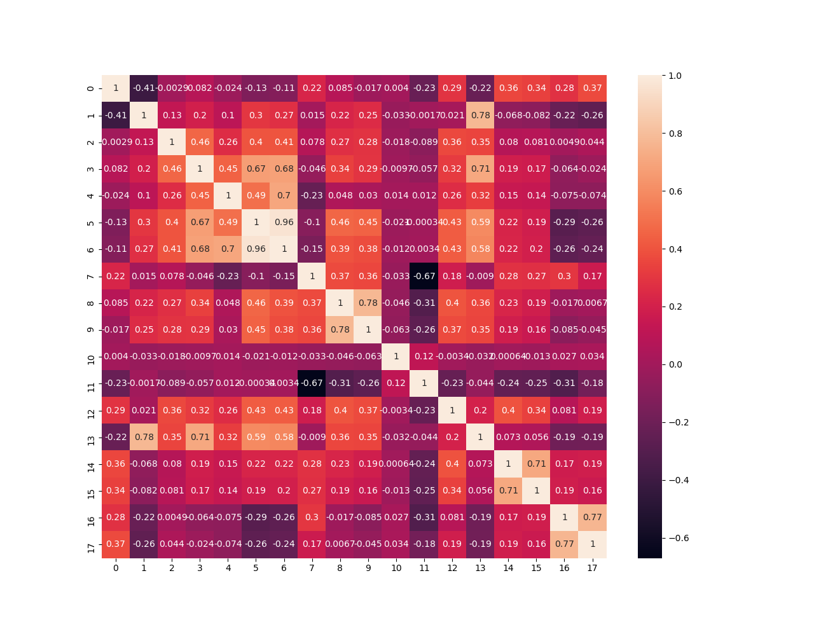
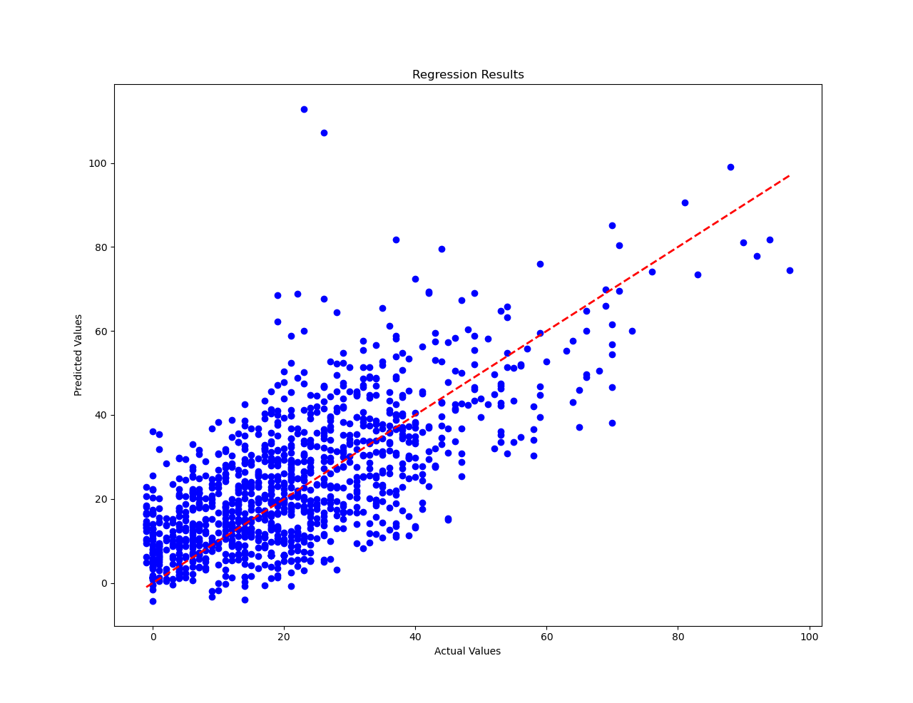
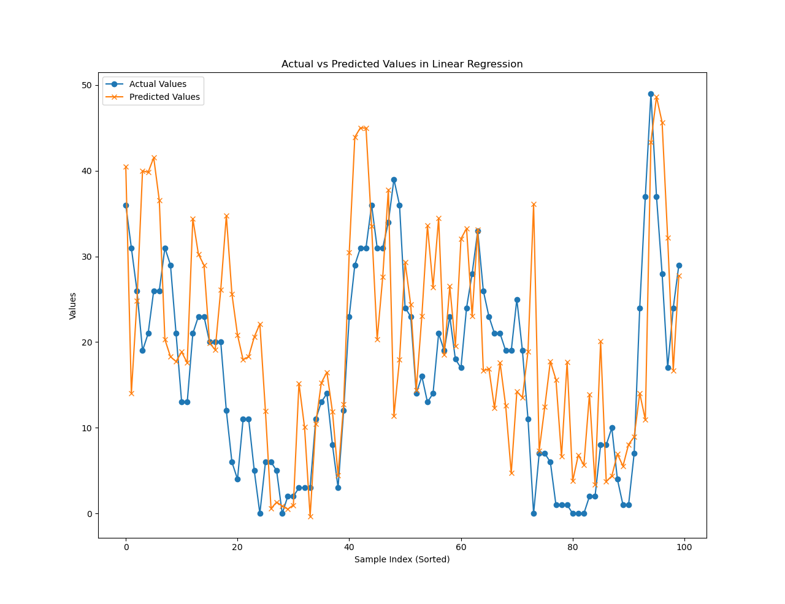

# DNN

## 回顾

本文介绍了如何使用 PyTorch 实现一个简单的深度神经网络（DNN）模型，并用于回归任务。该模型通过训练数据集来预测PM2.5。代码通过读取数据集、数据处理、模型训练和模型评估等步骤，详细展示了整个实现过程。

## 数据集介绍

Data 含有 18 项观测数据 AMB_TEMP(环境温度), CH4(甲烷), CO(一氧化碳), NMHC(非甲烷总烃), NO(一氧化氮), NO2(二氧化氮), NOx(氮氧化物), O3(臭氧), PM10, PM2.5, RAINFALL(降雨量), RH(相对湿度), SO2(二氧化硫), THC(总碳氢化合物), WD_HR(小时平均风向), WIND_DIREC(风向), WIND_SPEED(风速), WS_HR(小时平均风速)。
纵向为日期从2014/1/1到2014/12/20，其中每月记录20天，横向为每日24小时每一小时的记录。

## 代码分析

### 数据集读取

使用pandas读取数据集，查看数据量

```
# 读取训练数据集
train_data = pd.read_csv("../dataset/train.csv", encoding="big5")
train_data = train_data
print(len(train_data))
```

### 数据处理

查看数据集的基本信息和缺失值情况。

```
# 打印数据集的最后几行和信息摘要
print(train_data.tail())  # 打印数据集的最后几行
print(train_data.info())  # 打印数据集的信息摘要
```

去除不需要的列，查看到降雨量一列均为字符串’NR‘，将’NR‘全置为0

```
train_data = train_data.iloc[:, 3:]
train_data[train_data == 'NR'] = 0
numpy_data = train_data.to_numpy()

```

查看数据集缺失值情况，没有缺失值

```
# 检查数据集中的缺失值情况
print(train_data.isnull().sum())
print(train_data.head())
```

对数据进行整理，整理成需要的形式即变量字段按时间顺序排列

```
datas = []
for i in range(0, 4320, 18):
    datas.append(numpy_data[i:i+18, :])

datas_array = np.array(datas, dtype=float)
train_data = pd.DataFrame(datas_array.transpose(1, 0, 2).reshape(18, -1).T)
```

计算变量之间的相关性，去除一些相关性比较低的特征，这里去除掉相关系数绝对值小于0.2的特征（注意：并不一定要做这一步，需要根据实际情况进行对比实验）

```
# 计算特征相关性矩阵
corr = train_data.corr()

# 绘制相关性热图
plt.figure(3)
sns.heatmap(corr, annot=True)
# 从相关性矩阵中选择重要的特征
important_features = []
for i in range(len(corr.columns)):
    if abs(corr.iloc[i, 9]) > 0.2:  # 选择与目标值相关性系数大于 0.5 的特征
        important_features.append(corr.columns[i])

print("重要特征：", important_features)
```

可以看到以下的相关性矩阵，对角线全为1表示每个变量对自己的相关性都是最高的，每一个方块都表示不同的两个变量之间的相关性，颜色亮度越高表示正相关性越高，颜色越深表示负相关性越高。



划分特征和目标

```
# 将数据集划分为特征集（X）和目标集（y）
X = train_data[important_features].drop(9, axis=1)
y = train_data[9]

print(X)
print(y)
```

按比例划分数据集

```
# 将数据集按比例划分为训练集和测试集
train_ratio = 0.8
X_train = X[:int(train_ratio * len(train_data))]
X_test = X[int(train_ratio * len(train_data)):]
y_train = y[:int(train_ratio * len(train_data))]
y_test = y[int(train_ratio * len(train_data)):]
```

对所有特征进行标准化缩放

```
# 使用标准化进行特征缩放
scaler = StandardScaler()
X_train_scaled = scaler.fit_transform(X_train)
X_test_scaled = scaler.transform(X_test)
```

将数据转换为pytorch能接受的张量形式

```
# 将数据转换为 PyTorch 张量
X_train_tensor = torch.tensor(X_train_scaled, dtype=torch.float32)
y_train_tensor = torch.tensor(y_train.values, dtype=torch.float32).view(-1, 1)
X_test_tensor = torch.tensor(X_test_scaled, dtype=torch.float32)
y_test_tensor = torch.tensor(y_test.values, dtype=torch.float32).view(-1, 1)
```

将数据送入数据加加载器

```
# 创建数据加载器
train_dataset = TensorDataset(X_train_tensor, y_train_tensor)
train_loader = DataLoader(train_dataset, batch_size=64, shuffle=True)
```

### 模型训练

定义一个简单的四层DNN模型，input_size为特征数，hidden_size为隐藏层大小这里设为256，output_size为目标维度，这里设为1。

```
# 定义一个简单的 DNN 模型
class DNN(nn.Module):
    def __init__(self, input_size, hidden_size, output_size):
        super(DNN, self).__init__()
        self.fc1 = nn.Linear(input_size, hidden_size)
        self.fc2 = nn.Linear(hidden_size, hidden_size)
        self.fc3 = nn.Linear(hidden_size, hidden_size)
        self.fc4 = nn.Linear(hidden_size, output_size)
        self.relu = nn.ReLU()

    def forward(self, x):
        x = self.relu(self.fc1(x))
        x = self.relu(self.fc2(x))
        x = self.relu(self.fc3(x))
        x = self.fc4(x)
        return x
```

实例化模型，将模型送入gpu

```
# 实例化模型
input_size = X_train_tensor.shape[1]
hidden_size = 256
output_size = 1
model = DNN(input_size, hidden_size, output_size).to(device)
```

定义损失函数和优化器

```
# 定义损失函数和优化器
criterion = nn.MSELoss()
optimizer = optim.Adam(model.parameters(), lr=0.01))
```

开始循环训练模型，循环次数为500次，打印损失

```
# 训练模型
num_epochs = 500

for epoch in range(num_epochs):
    model.train()
    total_loss = 0
    for inputs, labels in train_loader:
        optimizer.zero_grad()
        inputs = inputs.to(device)
        labels = labels.to(device)
        # 前向传播
        outputs = model(inputs)
        loss = criterion(outputs, labels)

        # 反向传播和优化
        loss.backward()
        optimizer.step()
        total_loss += loss.item()

    avg_loss = total_loss / len(train_loader)
    if (epoch + 1) % 10 == 0:
        print(f'Epoch [{epoch + 1}/{num_epochs}], Loss: {avg_loss:.4f}')
```

### 模型评估

对模型进行评估，打印MSEloss

```
# 评估模型
model.eval()
with torch.no_grad():
    predictions = model(X_test_tensor.to(device))
    test_loss = criterion(predictions, y_test_tensor.to(device))

# 将预测值和目标值转换为 NumPy 数组
predictions = predictions.cpu().numpy()
y_test_numpy = y_test_tensor.cpu().numpy()

print('MSE', test_loss)
```

绘制回归结果，图中红色线表示对角线即预测值等于实际值，因此蓝色的散点若位于直线附近表示回归效果良好。

```
# 绘制结果
plt.figure(1)
plt.scatter(y_test_numpy, predictions, color='blue')
plt.plot([min(y_test_numpy), max(y_test_numpy)], [min(y_test_numpy), max(y_test_numpy)], linestyle='--', color='red',
         linewidth=2)
plt.xlabel('Actual Values')
plt.ylabel('Predicted Values')
plt.title('Regression Results')
```



绘制预测值与实际值的对比图

```
# 绘制实际值和预测值的曲线
plt.figure(2)
plt.plot(y_test_numpy[-100:], label='Actual Values', marker='o')
plt.plot(predictions[-100:], label='Predicted Values', marker='x')
plt.xlabel('Sample Index (Sorted)')
plt.ylabel('Values')
plt.title('Actual vs Predicted Values in Linear Regression')
plt.legend()
plt.show()
```


